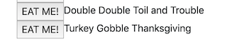
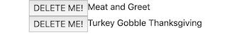

# EAT-DA-BURGER - Node Express Handlebars

### Overview

Eat-da-burger! is a full stack application that logs burgers using MySQL, Node, Express, Handlebars and a homemade ORM (yum!). The app follows a MVC design pattern, uses Node and MySQL to query and route data, and renders HTML using Handlebars.

### How it works

Eat-Da-Burger! is a restaurant app that lets users input the names of burgers they'd like to eat. Whenever a user submits a burger's name, the app will display the burger on the left side of the page -- waiting to be devoured.
Each burger in the waiting area also has a `EAT ME` it! button. When the user clicks it, the burger will move to the right side of the page. Once the burger is devoured, the button changes to `DELETE ME`, which gives the user the option to remove the burger from the database, and subsequently the page. This app will store every burger in a database, whether devoured or not.

### required npm packages

`express`, `path`, `mysql`

## User Flow

Users are greeted by a delicious burger.

Users can enter the name of their desired burger using a submit form.

![add-da-burger](public/assets/img/add-da-burger.png

That burger then gets added to the database and an `EAT ME` button is generated.

Once a user eats a burger, it moves to the right side of the screen and the button changes to `DELETE ME`, which removes the burger from the database.

### Technologies Implemented

* Bootstrap
* Express
* Node.js
* Heroku/JawsDB
* mySQL
* mySQL workbench

### Live site

* deployed: https://lil-burger-murderer.herokuapp.com/